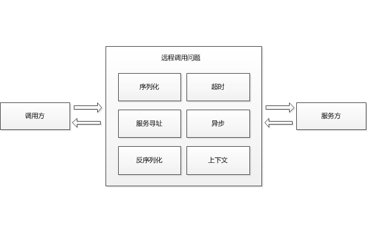
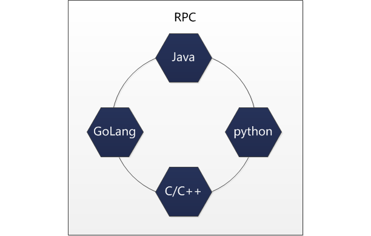
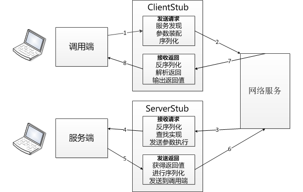
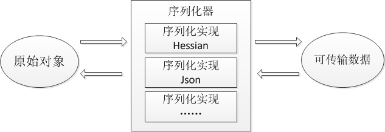
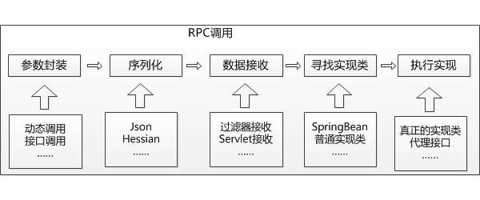
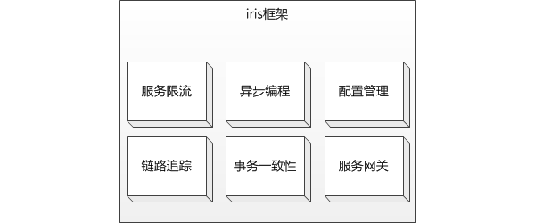
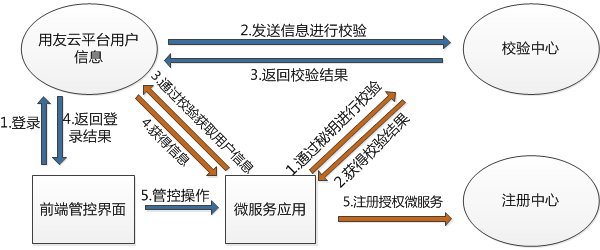

#微服务治理平台的RPC方案实现

**简介：**

本文主要探讨了rpc框架在微服务化中所处的位置，需要解决的问题。同时介绍了用友云微服务治理平台的rpc解决方案，为什么选择该方案、该方案提供的好处是什么。同时也会介绍用友RPC框架的基本结构以及在实现时所用到的一些关键技术。希望通过本文读者能够一窥用友rpc框架的原理，并藉此开发出更优秀的微服务应用。

##1.rpc在微服务中的重要性
随着越来越多的公司向着互联网方向转型，服务化这个概念已经深入人心。而rpc框架无疑是微服务中的重要一环。rpc框架的基本功能是将远程调用模拟成本地调用。调用本地函数很简单,传入参数执行逻辑获得返回值就可以了。但是实现一个远程调用就要考虑的多一些：

如图所示，调用和服务双方就不得不考虑在调用过程中产生的一些序列化、服务寻址、超时、异步、上下文管理等非业务问题，这些问题并不是开发者的核心问题，但是繁杂远程调用实现却为开发者带来了巨大的工作量，这就为业务开发团队带来了一个不小的困扰。因此使用一个统一的rpc框架在应用微服务化进程中是相当重要的。

此外rpc框架还能够实现公司不同团队开发的异构应用提供互相调用的需求，通过统一的rpc调用框架java、go、python等语言开发的应用可以互相使用已存在的服务接口，解放了团队技术栈的限制、实现了各种服务实现上的解耦。

rpc调用框架是微服务化的必要条件，rpc框架的性能、功能、特性直接决定了微服务项目最终的表现。总而言之，搞微服务先要搞定RPC框架才行。

##2.rpc过程中要解决的问题

一个rpc框架至少要有上图中的几个调用流程：

1. 调用端发出调用方法(服务)的请求
1. ClientStub先进行服务发现，找到需要调用的服务，然后进行请求接口、方法、参数以及服务地址、请求Id的封装，包装成请求对象、序列化——编码，最后传输到网络上去
1. 服务端经过网络接受到请求
1. 首先ServerStub进行色字节流的反序列化、解析请求查找服务端的实现代码、发送参数到执行
1. 服务端的实现将返回值发送给ServerStub处理
1. ServerStub将result、返回状态码、请求id等进行包装成返回信息、序列化——编码、传输
1. ClientStub得到字节流，进行反序列化、解析返回值，将结果返给调用端
1. 调用端最终得到结果

通过上面的调用流程我们可以总结出以下几点在实现rpc框架时要解决的重点问题：

**1.确定rpc请求携带的信息**

rpc调用需要封装被调用方法的相关信息，这些信息需要进行编码。确定传输数据的数据结构。

**2.序列化**

确定了rpc请求消息内容要进行发送还需要为rpc框架选择一套可靠地序列化反序列化方案。目前序列化方案众多，我们要从rpc框架的需求出发选择合适的方案。序列化方案会对rpc的调用性能造成较大的影响我们一般将以下几点作为参考进行选择：

1. **通用性**，主要指序列化框架对各种不同对象序列化的能力，例如序列化方案是否能支持较复杂的类型、数组、泛型等。序列化框架的通用性越好对用户编写业务结构的限制就越小。
2. **性能**，性能是选择序列化方案的重要指标，一个工程可能很多功能模块都要调用微服务，有些微服务调用可能很频繁，每次微服务调用都会进行序列化和反序列化，如果选择的序列化方案效率低下会极大地影响整个系统的效率
3. **扩展能力**，序列化方案还要考虑可扩展性，在开发过程中一套序列化方案可能并不能够支持所有的需求，这就要求序列化方案具备一定的扩展能力。通过扩展接口能够处理特殊需求的

**3.网络通信问题**
消息序列化之后就是网络通信了，nio、netty等、http通讯框架都可以进行网络通讯，这方面可以根据具体需求来进行选择。

**4.服务发现**
微服务上线后，提供服务的地址可能是动态变化的。当服务地址产生变化时有可能不是一个实例而是多个实例进行变化。这时调用端的调用地址必然是需要作出改变的。为了满足这一需求rpc框架必须能够自动的发现提供服务的地址变化并实时更改，这样就需要一个服务注册和服务发现的框架。市面上流行的rpc框架例如dubbo使用的zookeeper，springcloud使用的是eureka。这些框架都各有各的优势和缺点。

##3.常见的rpc方案
下面我们介绍几种流行rpc方案：

**1.gRPC**

grpc是Google发布的开源RPC框架，使用HTTP/2协议并用ProtoBuf作为序列化工具。并且提供多种语言的客户端拥有非常丰富而实用的特性。

**2.Dubbo/Dubbox**

dubbo是阿里开源的RPC框架，和Spring框架结合使用很方便。该框架资料丰富使用广泛。dubbo曾经停止维护了一段时间，不过目前貌似又重启了孵化项目。

当当在dubbo的基础上经过自己的改进又实现了dubbox框架并且是实现了对REST的支持。

**3.Spring Cloud**

Spring Cloud 基于Spring Boot发展了一套rpc调用框架，但是不单单局限于rpc调用，它还具有配置管理，服务发现，断路器，智能路由，微代理，控制总线等相关功能，具有一整套的解决方案。Spring Cloud 整合了很多业界成熟的解决方案，例如Netflix、Kafka、Eureka、Zookeeper等可以根据自己项目需求进行自由选择

##4.我们的rpc方案亮点

GRPC和DUBBO的性能和效率不错，但是这两个RPC框架缺乏对于大型项目的配套解决方案，很多功能可能需要自行开发或者使用第三方的插件支持。

Spring Cloud虽然解决方案较为完善，但是并不能很好地支撑公司项目在注册、发现，动态和可视化配置，限流熔断，链路追踪、分析，异步调用，数据一致性处理，API网关等方面的需求。

这些开源框架的缺点导致其不能完美的覆盖用友云面向企业级应用时所产生的独特需求，因此我们决定自研一款rpc解决方案来解决这些问题，最终产品就是用友云rpc调用框架iris

用友RPC远程调用框架**iris在序列化**方面采用了可插拔的实现方式，并且预制了两种序列化方案：json序列化、hessian序列化。

iris框架通过序列化器可插拔的加载不同的序列化实现，在rpc调用过程中按照不同的需求使用不同的序列化实现将原始对象序列化为可传输数据。在iris框架中普通的rpc调用时通过hessian序列化的，而当面临一些特殊的需求时，例如远程调用传递的参数或返回值在服务方并没有对应的实现类，这时就可以通过json序列化完成调用，而不必因为hessian序列化的特性导致无法发送rpc调用请求。

在通用性方面iris框架能够支持简单对象、复杂对象、数组、集合、泛型等多种参数和返回值类型，充分满足业务方对调用接口的各种需求。同时因为支持类型广泛，对老旧项目升级也更流畅，原始的接口不用花费太大代价就能改造成微服务。

**iris框架具有特殊的服务注册和服务发现机制**，这套机制主要由服务注册中心、服务元数据、iris服务发现机制组成。

- 服务注册中心脱胎于eureka，并通过增加权限校验机制有机的和用友云的用户系统结合在一起。注册中心通过http协议完成微服务注册，和微服务信息下发，因此能够穿透多册网络、nginx代理等，能够较好的适应复杂网络环境。此外注册中心还负责维护微服提供者的实时状态，及时剔除死亡实例
- 元数据则是存储于用友云平台中的RPC远程调用接口的描述信息，通过元数据用友云平台能够方便的收集微服务api信息，并且为后面的可视化管理以及数据分析打好基础。
- iris服务发现机制能够从微服务注册中心获得被调用微服务的访问地址，并且自存在多个服务实例时优先选择较近网络环境的实例。

**远程异常处理机制**是iris框架在远程实现发生异常时，调用端能够快速追踪问题的保证。

这套机制把异常分为三种类型声明异常、未声明异常、框架异常。并且将远程异常按照一定的规则序列化后传输到调用端，最终将异常在调用端抛出。使得rpc框架的异常能够像本地异常一样进行处理。此外对异常进行分类处理使得调用者能够清晰的分别异常是自己调用的代码错误、框架错误、还是远程实现发生了错误。藉此能够快速的分析定位问题，节省开发人员的时间和精力。

**iris能力扩展机制**能力扩展机制是iris框架为框架本事的功能开发预留的扩展接口，同时这套接口也能够提供给第三发开发者实现自己的逻辑。

上图是iris框架中一套基本的rpc调用链条，在这条链条中的几个关键节点参数封装、序列化、数据接收、寻找实现类、执行实现等我们都预留了扩展点，通过这些扩展点我们可以根据需求将功能逻辑作为插件插入到执行流程中

iris框架是用友云平台针对企业级微服务化开发的基础的RPC框架，只有一套RPC框架是不能够称之为微服务的。通过能力扩展机制iris框架引入了丰富的微服务核心功能。目前这套机制支撑了服务限流、异步编程、配置中心、链路追踪、一致性框架等平台功能，通过扩展机制用户可以简单的加载特定的依赖模块，无侵入的选用用友云平台的微服务扩展功能。

**iris安全校验**融合了用友云平台的权限校验机制，使得用户能够通过用友云平台的权限机制来管理微服务api。只有通过安全校验的微服务才能够注册到相应的开发者名下，同时开发者可以通过前端可视化界面决定微服务api的私有、公有、调用权限、管理权限。

iris框架是用友云平台针对企业级微服务开发推出的RPC调用框架，作为整个用友微服务解决方案的组成部分，该框架为平台提供了稳定高效的远程调用解决方案，并在这套方案的基础上提供了搭建其他微服务核心功能的骨架。同时iris框架也充分考虑到了用户易用性等需求使用iceberg依赖封装、isolate内部类隔离等机制打造了一套低侵入的代码引入方案，方便工程的改造和升级。

截至目前为止iris框架已经历经了多次迭代和升级，并且支撑了用友云平台大量应用的开发，在严峻的功能和性能的需求中得到了产品质量的验证。