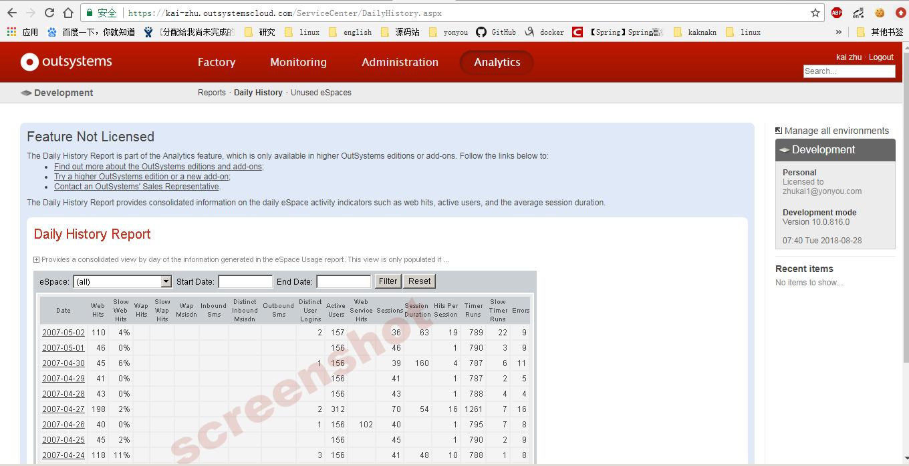

# 低代码工具outsystem

## 总结
低代码工具不同于以前开发的开发工具插件，其最鲜明的特点是有一套图形化的开发语言，低代码工具其实是这套图形开发语言的编译器。此外低代码工具要做到真正的低代码就必须覆盖用户的整个开发流程，代码设计、前端界面、后端逻辑、数据结构、部署发布都要有相应的支持。outsystem产品已经比较成熟了，我们的微服务开发工具起步阶段可以先覆盖微服务开发的核心步骤，减少一些工作量。

## outsystem概览

上面是outsystem的界面，这款工具给人的第一印象并不像一个IDE，而是更像PowerDisigner这类的设计工具。整个工具是看不到一段代码得，完全靠拖拽完成开发。

### 环境

环境是outsystem的基本概念，类似于eclipse的workspace。区别是outsystem的环境是云上的，项目一般保存在云上可以另存在本地，环境中项目的更新类似git，支持多用户开发。

### 应用

应用创建目前支持两种web_app和mobile_app,两种应用在开发上大同小异。主要区别在于移动应用开发在界面设计时的特殊处理较多。

### 四种编辑器

outsystem具有四种编辑器：

- 过程编辑器
- 前端界面
- 逻辑编辑
- 数据结构编辑

这四种编辑器是完成整个app开发最重要的部分。这四个编辑器负责完成了前端开发、后端开发、数据结构开发。其中过程编辑器可能没有那么必须，过程在outsystem的app中起到的作用有点像数据库的存储过程，同样的可以通过触发器进行出发，也可以做成定时任务等。

在普通的app开发过程中后端有后端的逻辑和数据，前端有前端的逻辑和数据。而且近年来时兴的前后端分离和前端工程化导致app开发前后端基本上割裂的。但是outsystem的开发模型有在数据和逻辑方面有些模糊前后端的区别，一份数据结构前后端是都可以用的。

四种编辑器的文件结构：

## outsystem能力

### UI设计

outsystem的UI设计能力相当不错，首先是图形化的的编辑器。之前也提到过这个编辑器是完全图形化的，就像是vb去掉了代码部分一样，通过拖拖拽拽就能完成界面的开发。这套UI设计系统提供了很多组件像主题、表单、图标、控件、富文本编辑器、还能分层据文档介绍还支持通过js进行功能扩展。不过如果需要比较特殊的效果这套控件可能就支持不了。

### 数据开发

数据开发这块，用什么数据库？、怎么部署？、怎么灾备？这些东西都被开发工具屏蔽了，直接从建模开始，建好了数据模型能自动生成数据实体。生成实体以后还可以更具表属性自动生成查询方法，如果有比较特殊的查询要求还能够自己写filter，联表查询等操作实现起来都比较容易。

比较特殊的是除了数据建模、持久化、Curd操作之外，outsystem的数据管理还包含session数据、前端vo、枚举类型、资源文件、站点属性等数据。相当于前端数据和后端数据是放在整个一大块管理的。不过前端数据的Curd操作还是被算成了Action而非像后端数据一样的Data Function。

### 逻辑开发

逻辑开发包含了普通app开发的前端逻辑和后端逻辑，其实就是用一套图形化开发语言完成了我们用不同语言开发的前端和后端。

outsystem会为app自动整合一套权限管理的逻辑，用户系统走的是outsystem的账号系统，考虑到低代码开发的特殊性如果不用他这套系统也很难找到第三方实现。这套权限验证是可以改造的，不过切账号系统的逻辑还是需要自己拖出来，挺麻烦的。

outsystem的精华我感觉就体现在各种组件上。逻辑组件库是整个开发工具的一部分，功能很丰富。前端方面有图表逻辑、富文本组件逻辑、控件逻辑等。后端有系统api、平台api、用户api等组件，同时还内建了一大堆函数数学、文本、时间、集合、格式化、网络通信等，一般的项目开发还是能通过这套库撑起来的。但是如果你的需求在预制库里面没有支持实现起来就比较费事了。比如我需要引入kafka之类的中间件client但是预制库里并没有相关的函数，想实现这个功能的话可能就需要使用开发工具提供的集成功能了，这个集成功能就是通过调用rest或者soap接口实现调用已经存在的功能，但是如果使用了这种方法也就违背了使用低代码工具的意义。所以我觉得低代码工具也是有他的局限的。

此外逻辑开发模块还具有定时任务、异常处理、自动日志等实用功能

### 扩展和集成

outsystem能够支持对代码进行扩展，不过这个代码扩展限制是吧比较多的。首先它支持实用其他app的模块进行扩展……其实就是代码复用和组件化。还能够支持js代码扩展，这个应该在前端页面编写上比较有用。

集成方面实现了rest、soap、sap远程接口的调用，当然序列化和反序列化也是有的。

### 过程开发

过程开发感觉就是数据库存储过程的变种，能够通过触发器、回调、定时器等触发执行。比较特殊的是这里的过程除了数据操作，前端和后端的一些操作也能触发相应的过程。

看了一些outsystem的例子，它的过程放了很多我们直接放在函数里的逻辑，比如新建用户时为新用户授予一些基本权限，这些操作就被放到了过程类。这侧面说明了只是依靠预制的一些逻辑完全支撑功能可能还是有难度的，有时需要通过过程触发这种操作从另一个角度解决问题。

### 调试

outsystem是带有调试系统的，这个其实挺有趣的。能够再我们画出来的流程图上打各种断点，还能远程调试，调试断点还能设置各种条件，也能像java一样加各种异常断点，功能挺强大的。

### 应用生命周期管理（部署、评价获取、监控和问题定位）

平台为应用提供了整个声明周期的支持，主要由工厂、监控、管理、分析这四个模块提供。这部分功能很多都是需要付费的。

**部署功能**真的是一件部署，点一下就能够在网上访问了。没有资源配置之类的环节，操作很便捷，体验不错。看了一下平台上的设置部署也是分环境的开发环境和生产环境。

红圈的这个按钮点一下就发布了，所见即所得。这个是我发布的一个helloworld示例： <a href ="https://kai-zhu.outsystemscloud.com/testzhumod1/">示例地址</a>

平台还能对权限进行管理，包括用户管理、角色管理之类的。同时还提供一些安全性的设置例如使用https

**监控功能**主要是系统运行的日志，基本上没有图标的展示略显简陋了。不过也肯能是因为我用的试用版，高级功能都没有开启，这部分错误日志、一般日志、网络请求日志、移动请求日志、等等日志还是比较全面的。因为整个应用都是使用outsystem的架子搭建起来的因此日志的输出还是比较详细和规范的。不过话说回来了我就部署了个helloworld发现后台就已经除了几个timeout了。看了一下是部署时抛出的，可能是国内的网络环境还是和他这个平台适配的不太好。

**分析功能**是彻底的付费服务，这方面看了一下给出的文档，列表、图标、自由选择时段分析都是有的。生成的报告能够展示资源的使用情况、各种请求的返回正确率、慢sql、慢定时器等。基本上开发工具提供可能造成瓶颈的组件在分析功能上都能生成对应的报告。

##功能亮点
outsystem给我最大的印象就是极其丰富的模板、组件库、内置函数。我觉得它的这套开发框架进行扩展还是比较困难的，使用这套开发工具的目标用户可能也不具备扩展的能力。但是开发工具本身自带的组件基本上就能够满足简单业务的开发，同时因为组件切分的比较细，通过对组件和函数的组合还能够在由用户自己开发出一套自定义组件补充开发库的不足。

其次outsystem覆盖了用户的整个开发流程，前端、后端、持久化一条龙，都用这个工具就搞定了。我觉得这个特征是低代码工具所必需的。低代码工具可以做的比较专精某一块，但是在这块领域要做到全覆盖，基本的功能通过低代码工具就完成了而不需用户去借助其他的工具实现。

##ps

outsystem开发工具和平台都是用的微软的.net框架，数据库搞得是sql server，互联网常用的一些中间件比如redis、mongodb、kafka等一个都没见到。这些高级功能还是要自己开发的，但是从他这套框架实现的组件来看，没有这些功能可能只是因为平台的限制，可能他们的目标用户也不是很需要这种功能。

我本来准备试用一下三家的开发平台，分别是outsystem、google的AppMaker（G suite）、微软的PowerApps。但是在实际操作中AppMaker需要提供企业所拥有的域名，并且需要证明这个域名确实是注册用户所能操作的（具体的验证方法是提供文件、或者在域名服务器添加html文件证明），PowerApps稍微好一些但是有邮箱就可以了，但是邮箱必须是企业邮箱，我填了咱们公司的邮箱但是收不到校验邮件。只有outsystem是比较容易使用的，注册和相关要求比较低。最后只能选择outsystem来简单了解一下低代码工具了。

此外市面上其他的低代码工具还挺多的，国内还有家叫魔方网表的，这家专注做报表app的我看了下文档竟然还支持用友U8的数据导入。我觉得特化自己的能力优化到极致也是低代码工具的一个发展出路。